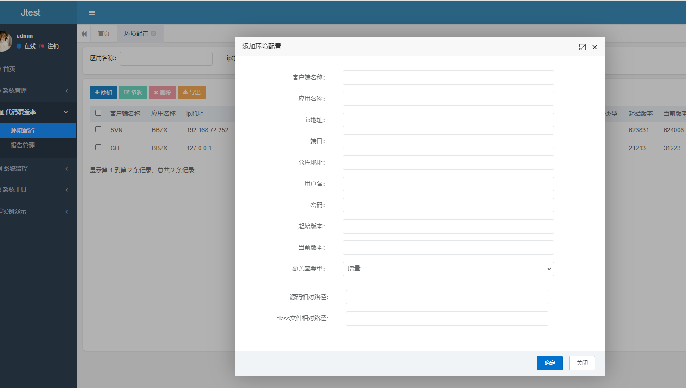
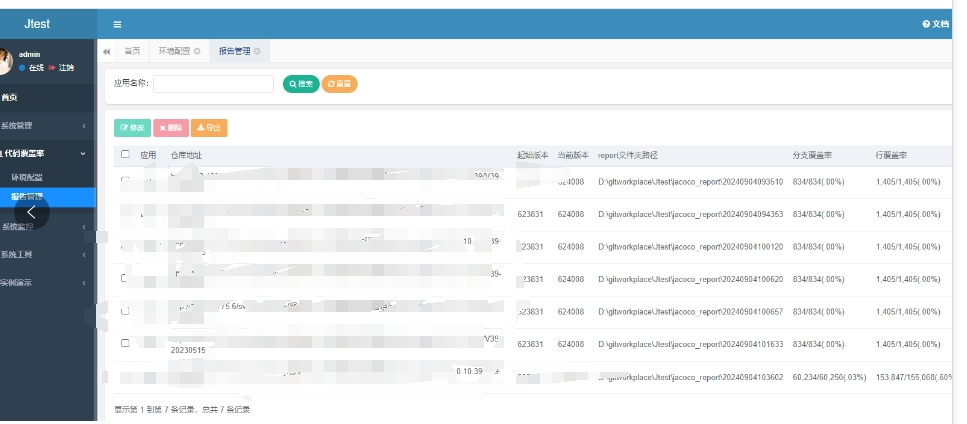

	

<h1 align="center" style="margin: 30px 0 30px; font-weight: bold;">Jtest v1.0.0</h1>
<h4 align="center">Jtest精准测试平台</h4>
##平台简介

在公司做覆盖率工具的时候，在网上找了一圈没有现成的精准测试平台，所以自己开发了，开源给有需要的人使用，当然您也可以进行二次开发，
   深度定制适合公司的版本，或者也可以找我定制其他的功能。

##技术架构

 使用若依4.7.9前后端不分离的版本，获取增量差异代码模块使用了ray佬的code-diff，基于jacoco的覆盖率统计。

##平台功能介绍

1、环境配置功能
   在配置环境信息后，一键生成全量或者增量的覆盖率报告。支持git和svn仓库，同个分支或者不同分支的配置。需要注意的是由于源码和class文件的不确定性，需要配置
   源码相对路径和class文件相对路径，根路径为仓库下载的路径，这部分功能可以根据公司项目特点自己改造。目前的做法是在克隆好
   仓库后，对仓库进行编译，编译完成的class有可能和运行时可能有不一样的classId导致覆盖率获取失败。如出现这种情况，可以手动把class文件放入到配置的路径中。
   或者修改我开源的agent的从远程下载jar包的方法，或者也可以找我定制这部分的功能。
   
2、报告管理

   支持查看报告和支持合并报告，jacoco-cli使用的是我另一个开源项目[https://gitee.com/chen_zai_xing/jacoco](http://gitee.com/chen_zai_xing/jacoco)
   支持了不同classId的覆盖率合并功能。

  
##部署方法
   在配置的数据库中执行sql目录下的Jtest_20240906.sql和quartz.sql
   可以自己编译源码部署，或者从发布版中下载编译好的jar包，使用Jtest.bat或者Jtest.sh启动。注意从发布版中下载的jar包需要用
   360压缩修改application.yml的配置文件数据库地址和maven目录后替换修改后的文件。配置maven是因为代码编译需要。默认端口
   是8090，运行成功后访问http:\\localhost:8090
   
   
   开源不易，如对您有帮助有富裕的可以请作者喝一杯咖啡~
  
   
  

